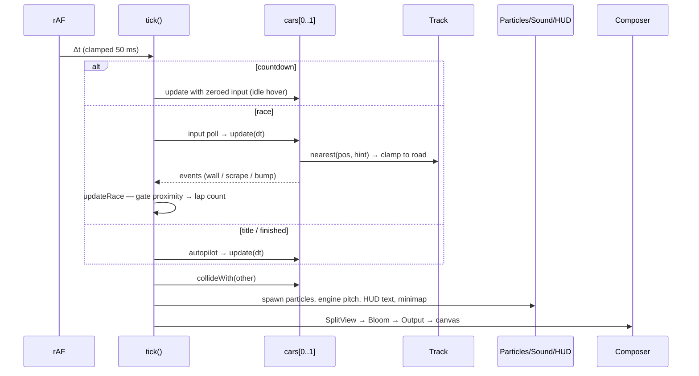
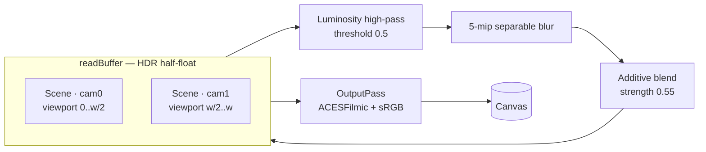
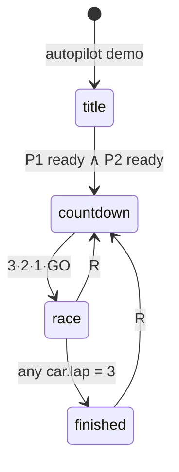

# NEON GRID GP — Architecture

A local-multiplayer 3D racing game built as a **dependency-free ES-module web app**.
No build step: the browser loads modules directly, Three.js is vendored, all
textures and sounds are generated procedurally at runtime. The document below
describes the system design, data flow, and the reasoning behind key decisions.

---

## 1. Design goals

| Goal | Approach |
|---|---|
| Two players, one keyboard | True split-screen: two chase cameras, two GL viewports in one framebuffer |
| "High-end" look on stock hardware | HDR pipeline + selective bloom + fully emissive scene; no shadow maps needed |
| Zero asset pipeline | Canvas-generated textures, procedural geometry, synthesized WebAudio |
| Zero tooling | Static files only — runs from any web server, GitHub Pages included |
| 60 fps on a laptop GPU | Fixed-capacity buffers, zero per-frame allocations in the hot loop |

## 2. System overview

```mermaid
flowchart TB
    subgraph Browser
        K[Keyboard input] --> M

        subgraph main.js — orchestrator
            M[Game state machine<br>title · countdown · race · finished]
            M --> R[Race logic<br>gates · laps · positions · timing]
            M --> CI[Chase cameras<br>per-player · FOV kick · shake]
        end

        subgraph Simulation
            C1[Car 0 — cyan<br>arcade hover physics] 
            C2[Car 1 — magenta<br>arcade hover physics]
            C1 <-->|collision| C2
        end

        subgraph World — track.js
            S[CatmullRom spline<br>16 ctrl pts → 900 samples]
            RD[Road ribbon mesh<br>+ neon rails + curbs]
            G[10 checkpoint gates]
            E[Sky, sun, grid floor,<br>mountains, rings, stars]
        end

        subgraph Effects / Presentation
            P[Particle pool<br>3 500 pts, custom shader]
            A[WebAudio synth<br>engines · SFX]
            H[DOM HUD + minimap]
        end

        M --> C1 & C2
        C1 & C2 -->|nearest-sample query| S
        M --> P & A & H

        subgraph Render — per frame
            SV[SplitViewPass<br>scissored L/R viewports]
            BL[UnrealBloomPass<br>HDR selective bloom]
            OP[OutputPass<br>ACES + sRGB]
            SV --> BL --> OP
        end

        CI --> SV
        S & RD & G & E & P --> SV
    end
```

## 3. Module responsibilities

| File | Exports | Responsibility |
|---|---|---|
| `src/main.js` | — (entry point) | Renderer/composer setup, `SplitViewPass`, input mapping, the `tick()` loop, state machine, race progression, cameras, autopilot, event dispatch (wall/scrape/bump) |
| `src/track.js` | `buildWorld(scene)` → `track` | Control-point spline → dense sample array; procedural road/rail/curb ribbon geometry; gate arches; sky, sun, stars, mountains, floating rings; `nearest(pos, hint)` spatial query |
| `src/car.js` | `Car` | Hover-car mesh construction (extruded hull, pods, wing, underglow sprite); arcade physics (`update`), road constraint, car-vs-car `collideWith` |
| `src/effects.js` | `Particles` | Ring-buffer GPU particle system — `spawn`, `burst`, `flame`, `sparks` — one `THREE.Points` draw call, custom `ShaderMaterial` (per-particle size + fade) |
| `src/audio.js` | `Sound` | Lazy `AudioContext`, per-car engine synth (saw + sub → lowpass), boost noise loop, one-shot SFX (tones, noise bursts) |
| `src/hud.js` | `HUD` | DOM overlays (speed, position, lap, boost, times, warnings, banners) and the canvas minimap |
| `index.html` | — | Layout, HUD DOM, CSS theme, the import map |
| `vendor/` | — | `three.module.js` + the five post-processing addons it needs |

`main.js` owns all cross-module wiring. Modules never import each other —
the dependency graph is a star with `main.js` at the center, so each file stays
independently readable and testable.

## 4. Frame data flow



All mutation flows **downhill**: input → physics → rules → presentation → render.
Nothing in the presentation layer feeds back into simulation state, which keeps
the update order easy to reason about.

## 5. Rendering pipeline



`SplitViewPass` is a custom `Pass` that clears the target once, then renders the
scene twice with `setViewport`/`setScissor` — both views land in **one** HDR
buffer, so a single `UnrealBloomPass` blooms the whole frame (glow even crosses
the seam subtly, which reads as one shared world). `needsSwap = false` keeps the
scene in `readBuffer`; bloom composites in place; `OutputPass` tone-maps to screen.

Why not shadow maps / reflections: the art direction is emissive-on-dark — glow
itself carries the lighting. That frees the entire frame budget for bloom and
keeps the draw-call count under ~60.

## 6. Track representation

- **Source of truth:** 16 `Vector3` control points → closed `CatmullRomCurve3`.
- **Dense cache:** 900 samples, each `{ pos, tangent, normal }`, precomputed once.
  Everything downstream (road mesh, rails, gates, collision, minimap, autopilot)
  reads the same array — geometry and logic can never diverge.
- **Spatial query:** `nearest(pos, hint)` checks ±40 samples around the last
  known index (cars move < 40 samples/frame), with a full 900-scan fallback.
  O(1) amortized.
- **Road constraint:** lateral offset `lat = (pos − sample)·normal`; if
  `|lat| > roadHalf − 1.3` the car is projected back and its wall-parallel
  velocity survives — that's what makes grinding the rail feel right instead
  of sticky.

## 7. Vehicle physics (arcade hover)

```
speed'   += throttle·ACCEL·dt − drag
heading' += steer · TURN · authority(speed) · dt
vel      ← lerp(vel, heading·speed, GRIP·dt)     // drift
pos'     += vel·dt
```

- `authority` ramps steering in with speed (no turning while parked) and trims
  it at top speed.
- The `vel → heading·speed` lerp is the whole drift model: under hard steering
  the velocity vector lags the nose, producing controllable slide — and `slide`
  (the residual magnitude) doubles as the spark trigger.
- Boost is a resource-limited multiplier on accel and top speed.
- Collisions (car–car) are circle impulses; wall response is positional clamp
  + normal-velocity reflection − impact-proportional slowdown, camera shake,
  sparks.

## 8. Race rules



- 10 gates ring the circuit; each car tracks `nextGate` and only registers
  gates **in order** — shortcuts and wrong-direction passes can't count.
- Crossing gate 0 after all others ⇒ lap++, lap/best timing, and at
  `lap == TOTAL_LAPS` ⇒ `finishRank`, winner banner, confetti.
- Position = `(lap, sampleIndex)` lexicographic compare; finished cars keep
  their recorded rank.
- Wrong-way detection is a smoothed sample-index velocity — direction of
  travel around the spline, not heading.

## 9. Effects & audio

- **Particles:** one pool of 3 500 points; CPU ring buffer writes
  pos/vel/life/color/size into preallocated `Float32Array`s — zero GC pressure.
  A 30-line shader does size attenuation + radial-fade + additive blending.
  Emitters: boost flames (per-frame), scrape sparks, gate bursts, confetti.
- **Audio:** everything is synthesized — engines are `sawtooth + sine` through
  a tracking low-pass (pitch ∝ speed), boost is filtered looping noise, SFX
  are oscillator envelopes and shaped noise bursts. Context unlocks on first
  keydown per autoplay policy.

## 10. Input

Two fixed key maps (`KEYMAP`) — `keydown`/`keyup` populate a `keys` set;
`pollInputs()` snapshots it each frame, and a rising-edge handler drives
one-shot actions (ready-up, restart, pause). Gameplay code reads *player
intent flags*, never raw events — that's why the attract-mode autopilot can
drive the same `input` struct a human uses.

## 11. Extension points

- **New tracks:** replace the `ctrl` array in `buildWorld` — road, rails,
  gates, minimap, autopilot all follow automatically.
- **More players:** the per-player path is already index-driven; the limiter
  is viewports, not logic.
- **Online multiplayer:** the sim is deterministic-friendly — inputs are
  sampled into plain flags; swap `pollInputs` for a network source.
- **Power-ups:** spawn pickup meshes in `buildGates`, test proximity in
  `updateRace`, mutate car modifiers.

## 12. Debug hooks

`window.__dbg` exposes `{ cars, cams, renderer, scene, composer, track, race,
state, frames }` for console inspection, and `window.__bots = [true, true]`
enables self-driving cars during a race — the same path the attract mode uses.
