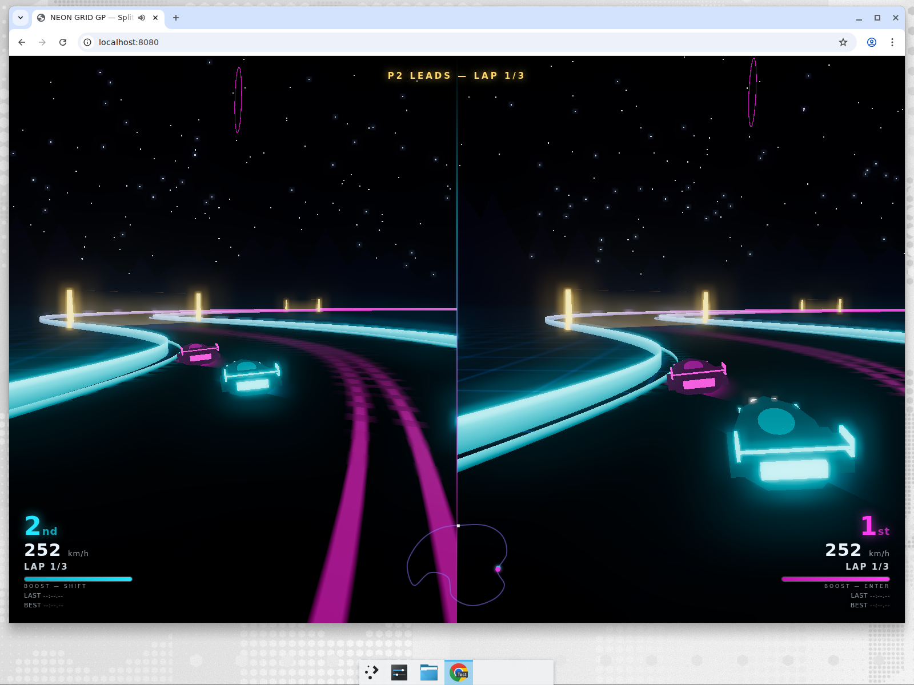

# NEON GRID GP

**Split-screen 3D hover racing for two players on one keyboard.** A synthwave-styled
arcade racer built on Three.js with a custom post-processing pipeline — bloom,
ACES tone mapping, emissive neon rails, synthesized WebAudio engine sounds, and a
full race loop (countdown → checkpoints → laps → podium).




## Quick start

No build step, no install — it's plain ES modules with vendored Three.js:

```bash
cd neon-racing
python3 -m http.server 8080
# open http://localhost:8080
```

Any static file server works (`npx serve`, `php -S`, nginx, GitHub Pages).

## Controls

| Action          | Player 1      | Player 2   |
|-----------------|---------------|------------|
| Throttle        | `W`           | `↑`        |
| Brake / reverse | `S`           | `↓`        |
| Steer           | `A` / `D`     | `←` / `→`  |
| Boost           | `Left Shift`  | `Enter`    |
| Restart         | `R`           | `R`        |
| Pause           | `Esc`         | `Esc`      |

## Rules

- Press your throttle on the title screen to ready up — race starts when **both** players are ready.
- **First to complete 3 laps wins.** Gates must be passed in order (they count as checkpoints).
- Boost drains the meter; it recharges when not in use.
- Wall hits cost speed and spray sparks. Wrong way? You'll be told.

## Features

- True split-screen rendering — two independent chase cameras with speed-adaptive FOV
- UnrealBloom post-processing over a shared HDR framebuffer
- Arcade hover physics: drift, banking, wall-slide, car-vs-car collisions
- 10-gate checkpoint system, lap timing (last / best), live position + minimap
- Particle system: boost flames, scrape sparks, checkpoint bursts, winner confetti
- Procedural audio: per-car engine synth, boost noise, countdown, fanfares — zero audio assets
- Attract mode: cars autopilot on the title screen

## Project layout

```
neon-racing/
├── index.html          # HUD DOM, styles, import map
├── src/
│   ├── main.js         # game loop, state machine, input, cameras, composer
│   ├── track.js        # spline circuit, road/rails geometry, world dressing
│   ├── car.js          # hover car mesh + arcade physics
│   ├── effects.js      # GPU particle pool
│   ├── audio.js        # WebAudio synth engine + SFX
│   └── hud.js          # DOM HUD + minimap
└── vendor/             # three.module.js + postprocessing addons (vendored)
```

See [ARCHITECTURE.md](ARCHITECTURE.md) for the system design.

*Built by [Devin](https://devin.ai).*
